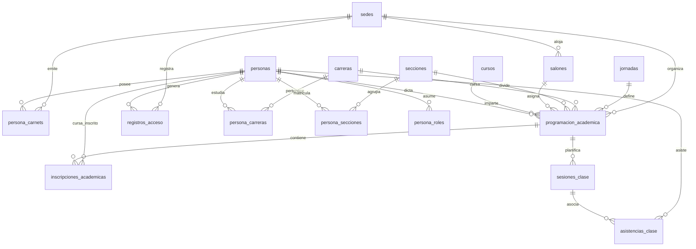

# Proyecto UMG Biometric System (RECK2) - Resumen y Estructura del Sistema

Este documento proporciona una guía exhaustiva, detallada y en español del proyecto **Reck2** (Sistema Biométrico de Asistencia y Acceso para la Universidad Mariano Gálvez). Cubre en profundidad la arquitectura del software, la base de datos (con todas sus tablas, relaciones, campos y triggers/stored procedures) y el flujo lógico de las aplicaciones web y de escritorio.

---

## 1. Resumen General del Proyecto

El sistema **RECK2** es una solución integral para el control de asistencia estudiantil, control de acceso físico (molinetes/puertas) y gestión académica de catedráticos y estudiantes en la UMG, basada en **Reconocimiento Facial Biométrico** usando visión por computadora.

El proyecto está dividido en dos interfaces principales que interactúan con el mismo motor de base de datos MySQL centralizado:

1. **Aplicación de Escritorio / Consola (`main.py`)**: 
   - Diseñada para la captura de video en tiempo real mediante cámara local (OpenCV).
   - Realiza la detección y el reconocimiento facial a través de la librería `face_recognition`.
   - Permite el registro de accesos en modo "Entrada General" o "Por Asignación de Curso" directamente desde la terminal con retroalimentación visual en pantalla (recuadros verdes para reconocidos y rojos para desconocidos).

2. **Plataforma Web (Flask) (`web/app.py`)**:
   - Una interfaz web moderna, responsiva y premium construida con Flask.
   - Permite la gestión administrativa completa de catálogos (sedes, jornadas, salones, carreras, secciones, cursos).
   - Control de usuarios y autenticación con roles (`SuperAdministrador`, `Administrador_Sede`, `Catedratico`, `Estudiante`).
   - Portal del catedrático para visualizar sus cursos asignados, iniciar clases, registrar asistencias biométricamente por medio de cámara web o manualmente, y generar reportes en PDF/Excel.
   - Portal del estudiante para visualizar su asistencia histórica, ver su perfil e imprimir su carnet universitario con código QR generado en tiempo real.
   - Generación de reportes dinámicos basados en estructuras de árbol de asistencia jerárquicas (Año -> Mes -> Semana -> Día).

---

## 2. Estructura de la Base de Datos

La base de datos se denomina `db_biometrico` y cuenta con un esquema de diseño relacional en MySQL totalmente normalizado para soportar multi-sede, multi-carrera, roles jerárquicos y programación académica compleja. A continuación se explican detalladamente todas las tablas en su orden de dependencia (esquema final).

### 2.1 Tablas Catálogo Base

#### 1. Sedes (`sedes`)
Almacena los campus físicos de la universidad.
* **Campos**:
  - `id` (INT, PK, AUTO_INCREMENT): Identificador único de la sede.
  - `codigo` (VARCHAR(30), NOT NULL, UNIQUE): Código corto identificador (ej. 'CENTRAL', 'BOCA_DEL_MONTE').
  - `nombre` (VARCHAR(100), NOT NULL): Nombre oficial de la sede.
  - `departamento` (VARCHAR(100)): Departamento geográfico.
  - `direccion` (VARCHAR(200)): Dirección física.
  - `activo` (TINYINT(1), DEFAULT 1): Indica si la sede está operativa.

#### 2. Jornadas (`jornadas`)
Define las franjas horarias generales del campus.
* **Campos**:
  - `id` (INT, PK, AUTO_INCREMENT): Identificador único.
  - `nombre` (VARCHAR(50), NOT NULL, UNIQUE): Nombre de la jornada (Matutina, Vespertina, Nocturna, Sabatina, Dominical).
  - `descripcion` (VARCHAR(150)): Breve descripción.
  - `activo` (TINYINT(1), DEFAULT 1): Estado activo/inactivo.

#### 3. Salones (`salones`)
Representa las aulas físicas donde se imparten las clases.
* **Campos**:
  - `id` (INT, PK, AUTO_INCREMENT): Identificador único.
  - `sede_id` (INT, FK -> `sedes.id`, ON DELETE CASCADE): Sede a la que pertenece el salón.
  - `codigo` (VARCHAR(30), NOT NULL): Código físico del salón (ej. 'A-301').
  - `nombre` (VARCHAR(100)): Nombre amigable.
  - `ubicacion` (VARCHAR(150)): Nivel, edificio o torre del salón.
  - `capacidad` (INT, DEFAULT 30): Capacidad máxima de alumnos.
  - `activo` (TINYINT(1), DEFAULT 1): Estado de disponibilidad.
* **Restricciones de Unicidad**:
  - `uq_salon_sede_codigo` (UNIQUE KEY): Impide que existan códigos duplicados en una misma sede.

#### 4. Carreras (`carreras`)
Catálogo de facultades o planes de estudio de la universidad.
* **Campos**:
  - `id` (INT, PK, AUTO_INCREMENT): Identificador único.
  - `nombre` (VARCHAR(100), NOT NULL, UNIQUE): Nombre completo de la carrera (ej. 'Ingeniería en Sistemas').

#### 5. Secciones (`secciones`)
Catálogo de grupos o letras de sección académica.
* **Campos**:
  - `id` (INT, PK, AUTO_INCREMENT): Identificador único.
  - `nombre` (VARCHAR(10), NOT NULL, UNIQUE): Letra o código de la sección (ej. 'A', 'B', 'C').

#### 6. Cursos (`cursos`)
Asignaturas académicas independientes de sedes y catedráticos.
* **Campos**:
  - `id` (INT, PK, AUTO_INCREMENT): Identificador único.
  - `codigo` (VARCHAR(30), NOT NULL, UNIQUE): Código del curso (ej. '090').
  - `nombre` (VARCHAR(100), NOT NULL): Nombre del curso (ej. 'Programación III').
  - `activo` (TINYINT(1), DEFAULT 1): Estado.

---

### 2.2 Gestión de Personas y Roles

#### 7. Tipos de Persona (`tipos_persona`)
Catálogo básico de roles académicos (histórico y de compatibilidad).
* **Campos**:
  - `id` (INT, PK, AUTO_INCREMENT): Identificador.
  - `nombre` (VARCHAR(50), NOT NULL, UNIQUE): Estudiante, Catedrático, Administrador, etc.

#### 8. Personas (`personas`)
Tabla central que unifica a todos los individuos del sistema (Estudiantes, Docentes y Personal Administrativo).
* **Campos**:
  - `id` (INT, PK, AUTO_INCREMENT): Identificador único de la persona.
  - `nombre` (VARCHAR(100), NOT NULL): Nombres del individuo.
  - `apellido` (VARCHAR(100), NOT NULL): Apellidos del individuo.
  - `email` (VARCHAR(100), NOT NULL, UNIQUE): Correo institucional.
  - `password_hash` (VARCHAR(255)): Contraseña cifrada en formato Blowfish/SHA-256 para el acceso al portal web.
  - `encoding_facial` (JSON o TEXT): Vector numérico de 128 elementos flotantes generado por el reconocimiento facial. Representa los rasgos biométricos del rostro del usuario para la validación visual en milisegundos.
  - `foto_ruta` (VARCHAR(255)): Ruta local o URL de la fotografía de perfil guardada en el servidor.
  - `activo` (TINYINT(1), DEFAULT 1): Estado lógico del usuario.
  - `creado_en` (TIMESTAMP, DEFAULT CURRENT_TIMESTAMP): Fecha de registro original.

#### 9. Roles de Persona (`persona_roles`)
Maneja los privilegios a nivel de sistema web en una estructura normalizada de muchos-a-muchos.
* **Campos**:
  - `id` (INT, PK, AUTO_INCREMENT)
  - `persona_id` (INT, FK -> `personas.id`, ON DELETE CASCADE)
  - `rol` (ENUM('SuperAdministrador', 'Administrador_Sede', 'Catedratico', 'Estudiante'), NOT NULL)
* **Restricciones de Unicidad**:
  - Un usuario no puede tener asignado el mismo rol de manera duplicada.

#### 10. Carnets de Persona (`persona_carnets`)
Unifica los números de carnet de los alumnos. El rediseño permite que un estudiante tenga un carnet único asignado para cada sede específica de la universidad.
* **Campos**:
  - `id` (INT, PK, AUTO_INCREMENT)
  - `persona_id` (INT, FK -> `personas.id`, ON DELETE CASCADE): Estudiante.
  - `sede_id` (INT, FK -> `sedes.id`, ON DELETE CASCADE): Sede asignada.
  - `carnet` (VARCHAR(30), NOT NULL): El carnet institucional (ej. '0901-20-4567').
* **Restricciones de Unicidad**:
  - `uq_persona_sede` (UNIQUE KEY): Limita a un carnet máximo por sede por persona.
  - `carnet` (UNIQUE KEY): Garantiza que ningún número de carnet se duplique en el universo institucional.

---

### 2.3 Relaciones Académicas Secundarias (Muchos a Muchos)

#### 11. Carreras de Persona (`persona_carreras`)
Relaciona a estudiantes con una o más carreras matriculadas.
* **Campos**:
  - `persona_id` (INT, FK -> `personas.id`, ON DELETE CASCADE)
  - `carrera_id` (INT, FK -> `carreras.id`, ON DELETE CASCADE)
  - Primary Key compuesta por ambos campos.

#### 12. Secciones de Persona (`persona_secciones`)
Registra las secciones a las que pertenece el estudiante.
* **Campos**:
  - `persona_id` (INT, FK -> `personas.id`, ON DELETE CASCADE)
  - `seccion_id` (INT, FK -> `secciones.id`, ON DELETE CASCADE)
  - Primary Key compuesta por ambos campos.

---

### 2.4 Programación Académica y Asistencias

La programación académica es la tabla más crítica y centralizada del sistema, ya que actúa como el nexo que unifica todas las variables operativas de la universidad.

#### 13. Programación Académica (`programacion_academica`)
Representa un curso específico en un salón, horario, sede, jornada, sección y catedrático definidos.
* **Campos**:
  - `id` (INT, PK, AUTO_INCREMENT): Identificador único de la asignación horaria.
  - `sede_id` (INT, FK -> `sedes.id`): Sede de la clase.
  - `jornada_id` (INT, FK -> `jornadas.id`): Franja horaria académica.
  - `carrera_id` (INT, FK -> `carreras.id`): Carrera de destino.
  - `seccion_id` (INT, FK -> `secciones.id`): Sección asignada.
  - `curso_id` (INT, FK -> `cursos.id`): Asignatura que se imparte.
  - `salon_id` (INT, FK -> `salones.id`): Aula del curso.
  - `catedratico_id` (INT, FK -> `personas.id`, ON DELETE SET NULL): Catedrático a cargo.
  - `dia_semana` (ENUM('Lunes','Martes','Miercoles','Jueves','Viernes','Sabado','Domingo')): Día de la semana que se imparte.
  - `hora_inicio` (TIME, NOT NULL): Hora exacta de inicio (ej. '18:00:00').
  - `hora_fin` (TIME, NOT NULL): Hora exacta de finalización (ej. '19:30:00').
  - `fecha_inicio` (DATE): Fecha de inicio del semestre.
  - `fecha_fin` (DATE): Fecha de fin del semestre.
  - `activo` (TINYINT(1), DEFAULT 1)

#### 14. Inscripciones Académicas (`inscripciones_academicas`)
Matrícula oficial de los estudiantes en los cursos específicos creados en la programación académica.
* **Campos**:
  - `id` (INT, PK, AUTO_INCREMENT)
  - `persona_id` (INT, FK -> `personas.id`, ON DELETE CASCADE): Estudiante matriculado.
  - `programacion_academica_id` (INT, FK -> `programacion_academica.id`, ON DELETE CASCADE): Clase programada.
  - `fecha_inscripcion` (TIMESTAMP, DEFAULT CURRENT_TIMESTAMP)
* **Restricciones de Unicidad**:
  - `uq_persona_programacion` (UNIQUE KEY): Impide que un estudiante se inscriba más de una vez en el mismo horario académico.

#### 15. Sesiones de Clase (`sesiones_clase`)
Representa una ocurrencia real del curso en un día específico del calendario escolar. Es iniciada por el catedrático al momento de habilitar la asistencia en su portal.
* **Campos**:
  - `id` (INT, PK, AUTO_INCREMENT)
  - `programacion_academica_id` (INT, FK -> `programacion_academica.id`, ON DELETE CASCADE): Clase asignada.
  - `fecha` (DATE NOT NULL): Día en que ocurre la sesión (ej. '2026-05-31').
  - `hora_inicio` (TIME NOT NULL): Hora real de apertura.
  - `hora_fin` (TIME NOT NULL): Hora estimada de fin.
  - `estado` (ENUM('PROGRAMADA', 'EN_CURSO', 'FINALIZADA', 'CANCELADA'), DEFAULT 'PROGRAMADA'): Estado operativo.
  - `observacion` (VARCHAR(255))
  - `fecha_creacion` (TIMESTAMP, DEFAULT CURRENT_TIMESTAMP)
* **Restricciones de Unicidad**:
  - `uq_sesion_prog_fecha` (UNIQUE): Solo puede existir una sesión por programación académica en una fecha determinada.

#### 16. Asistencias de Clase (`asistencias_clase`)
Registro individual de asistencia de cada estudiante para una sesión específica.
* **Campos**:
  - `id` (INT, PK, AUTO_INCREMENT)
  - `sesion_clase_id` (INT, FK -> `sesiones_clase.id`, ON DELETE CASCADE)
  - `persona_id` (INT, FK -> `personas.id`, ON DELETE CASCADE): Estudiante.
  - `fecha_hora` (TIMESTAMP, DEFAULT CURRENT_TIMESTAMP): Hora exacta en la que se capturó la cara o se hizo el registro.
  - `estado` (ENUM('PRESENTE', 'AUSENTE', 'TARDE', 'JUSTIFICADO'), DEFAULT 'PRESENTE')
  - `metodo` (ENUM('BIOMETRICO', 'MANUAL'), DEFAULT 'BIOMETRICO'): Determina si se validó por reconocimiento facial o si el docente lo marcó a mano en la tabla web.
  - `confirmado_por` (INT, FK -> `personas.id`, ON DELETE SET NULL): Catedrático que supervisó la asistencia.
  - `observacion` (VARCHAR(255))
* **Restricciones de Unicidad**:
  - `uq_asistencia_sesion_persona` (UNIQUE): Un alumno solo puede registrar su asistencia una única vez por sesión.

---

### 2.5 Registro de Accesos Físicos

#### 17. Registro de Accesos (`registros_acceso`)
Bitácora de seguridad global que graba todas las interacciones biométricas y físicas del sistema, por sede.
* **Campos**:
  - `id` (INT, PK, AUTO_INCREMENT)
  - `persona_id` (INT, FK -> `personas.id`, ON DELETE CASCADE): Individuo que ingresa.
  - `sede_id` (INT, FK -> `sedes.id`, ON DELETE CASCADE): Ubicación de la entrada.
  - `fecha_hora` (TIMESTAMP, DEFAULT CURRENT_TIMESTAMP): Estampa de tiempo.
  - `punto_acceso` (VARCHAR(50), DEFAULT 'ENTRADA_PRINCIPAL')
  - `metodo` (ENUM('BIOMETRICO', 'MANUAL', 'TARJETA'), DEFAULT 'BIOMETRICO')
  - `observacion` (VARCHAR(255))

---

## 3. Procedimientos Almacenados y Lógica de Negocio en la Base de Datos

### 3.1 Procedimiento `sp_eliminar_persona_completa`
Ubicado en `database/sp_eliminar_persona_completa.sql`. Este script es de vital importancia debido a que una persona puede estar interconectada en múltiples tablas como estudiante, catedrático o administrador.

Para evitar errores de integridad referencial o dejar registros huérfanos, el procedimiento encapsula una **transacción segura (ACID)** para borrar en cascada y de forma ordenada todos los datos vinculados a una persona:

1. **Declaración de rollback**: Si ocurre cualquier excepción SQL, se cancela la operación y no se modifica la base de datos.
2. **Desactivación de llaves foráneas temporal**: `SET FOREIGN_KEY_CHECKS = 0`.
3. **Inicio de Transacción**: `START TRANSACTION`.
4. **Borrado en orden**:
   - Elimina de `asistencias_clase` (asistencias tomadas).
   - Elimina asistencias donde la persona firmó como catedrático confirmador (`confirmado_por`).
   - Elimina de `inscripciones_academicas` (matrículas del alumno).
   - Elimina registros de accesos físicos de la bitácora (`registros_acceso`).
   - Borra de `persona_carnets` (carnets generados por sede).
   - Borra asignaciones de sección (`persona_secciones`) y carrera (`persona_carreras`).
   - Borra los roles asignados (`persona_roles`).
   - Modifica las programaciones académicas para desvincular al catedrático (colocando `catedratico_id = NULL`).
   - Finalmente, borra el registro de la tabla principal `personas`.
5. **Confirmación**: Se ejecuta `COMMIT` y se restablece `FOREIGN_KEY_CHECKS = 1`.

---

## 4. Diagrama de Relaciones y Flujo

A continuación se presenta un diagrama en formato Mermaid que ilustra claramente la compleja telaraña de relaciones de la base de datos.

---

## 5. Resumen de Flujos Lógicos Clave

### 5.1 Flujo de Registro de Asistencia Facial (Escritorio/Web)
1. El usuario se sitúa frente a la cámara (Webcam en portal web o cámara IP/USB en el script de consola `main.py`).
2. Se extraen los fotogramas (frames) del video en tiempo real.
3. Se ejecuta `face_recognition.face_locations` y `face_recognition.face_encodings` para generar un vector matemático a partir del rostro detectado.
4. El motor compara este vector contra los registros de la base de datos (`encoding_facial` en la tabla `personas`).
5. **Si se encuentra coincidencia**:
   - Se valida si es una **entrada general** o una **clase específica**:
     - *Entrada General*: Se comprueba que no tenga accesos registrados en los últimos minutos (cooldown). Si está limpio, se inserta en `registros_acceso` con método `BIOMETRICO`.
     - *Clase*: Se valida que el estudiante esté matriculado en ese curso (`inscripciones_academicas`). Se crea automáticamente la sesión de clase (`sesiones_clase`) si no existe para la fecha actual, y se registra la asistencia (`asistencias_clase`) como `PRESENTE` y método `BIOMETRICO`.
6. **Si no se encuentra coincidencia**:
   - El sistema pinta un rectángulo rojo y el estado queda registrado como "Desconocido".

### 5.2 Flujo de Generación de Carnet Digital
1. El estudiante inicia sesión en el portal web Flask.
2. Ingresa a la sección "Mi Perfil" / "Imprimir Carnet".
3. El archivo `web/id_card_generator.py` captura los datos de la base de datos (nombre, carnet por sede, carrera y foto).
4. Genera dinámicamente un código QR que apunta a la verificación del estudiante en el portal web.
5. Dibuja un lienzo digital premium aplicando una plantilla institucional con el logo de la universidad, superpone la foto, los textos y el QR, exportando el carnet como un archivo de imagen final listo para imprimir.

Este robusto ecosistema provee un control de asistencia automatizado de última generación que reduce al mínimo las suplantaciones de identidad y optimiza drásticamente las tareas administrativas de los catedráticos de la Universidad Mariano Gálvez.
