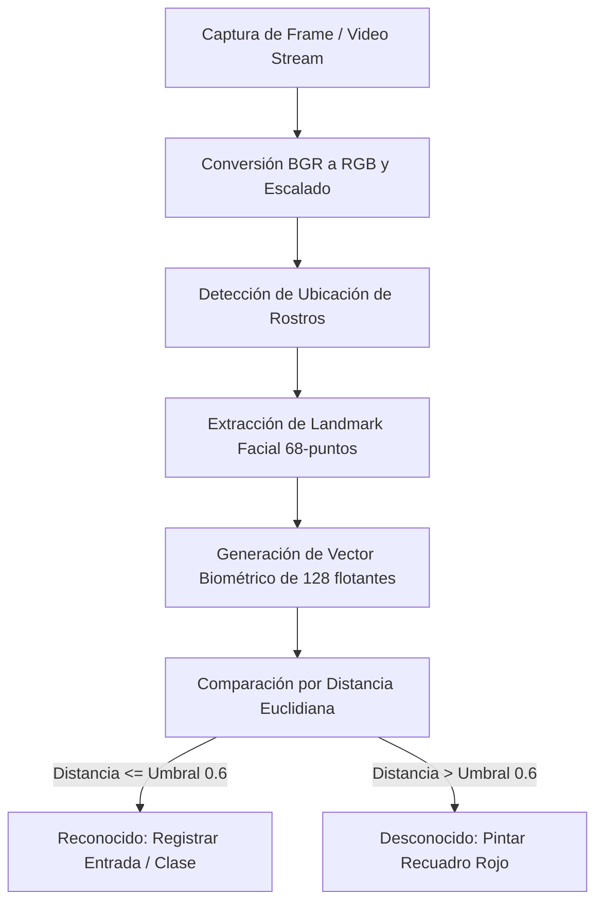

# Sistema de Reconocimiento Facial Biométrico UMG (RECK2)

Este documento detalla a nivel de ingeniería la tecnología, librerías, algoritmos, flujo de procesamiento, configuraciones y los fragmentos de código clave que componen el sistema de reconocimiento facial del proyecto **RECK2**.

---

## 1. Stack Tecnológico del Reconocimiento Biométrico

El motor de reconocimiento facial está construido completamente sobre el ecosistema de Python para Inteligencia Artificial y Visión por Computadora. Utiliza tres pilares principales:

```
[ Fotograma / Stream de Video ] 
             │
             ▼
      [ OpenCV (cv2) ] ───────► (Captura de imagen, preprocesamiento y escalado)
             │
             ▼
  [ face_recognition ] ───────► (Detección de caras con HOG / Redes Convolucionales CNN)
             │
             ▼
      [ dlib / Numpy ] ───────► (Extracción del descriptor biométrico de 128 flotantes)
             │
             ▼
  [ MySQL / db_manager ] ─────► (Comparación Euclidiana contra encondings almacenados)
```

### A. dlib & face_recognition
* **Descripción**: La librería `face_recognition` (creada por Adam Geitgey) sirve como interfaz de alto nivel sobre `dlib`. `dlib` es una biblioteca moderna de C++ que contiene herramientas de Machine Learning y algoritmos de procesamiento de imágenes.
* **Modelo Utilizado**: Emplea una red neural profunda entrenada con un dataset de más de 3 millones de rostros (modelo basado en ResNet-34). Consigue una precisión del **99.38%** en el benchmark estándar de la industria LFW (*Labeled Faces in the Wild*).

### B. OpenCV (Open Source Computer Vision Library)
* **Descripción**: Se encarga de la manipulación de imágenes de bajo y medio nivel: captura de flujos de video RTSP/USB, conversión de espacios de color, escalado bidimensional y dibujo de overlays (recuadros, nombres) sobre la pantalla.

### C. NumPy
* **Descripción**: Provee soporte para vectores y matrices multidimensionales de alta eficiencia. Se utiliza para almacenar el descriptor facial (un vector unidimensional de tipo `numpy.ndarray` con **128 números de punto flotante**) y realizar comparaciones euclidianas a nivel de CPU ultrarrápidas.

---

## 2. Flujo Algorítmico Paso a Paso

El proceso biométrico se realiza en 4 etapas críticas desde que la cámara captura un fotograma hasta que se guarda el registro de asistencia en el servidor:



### Paso 1: Localización del Rostro (*Face Detection*)
El sistema escanea la imagen para encontrar dónde hay caras. Por defecto, utiliza el algoritmo **HOG** (*Histogram of Oriented Gradients*), que analiza los gradientes de luz y sombra de los bordes de la imagen para determinar siluetas faciales de manera rápida y eficiente en CPUs comunes.

### Paso 2: Alineación y Puntos de Referencia (*Face Landmarks*)
Una vez localizada la cara, dlib extrae **68 puntos de referencia faciales** específicos (los ojos, la nariz, la forma de la barbilla, las cejas y los labios). El algoritmo utiliza esta estructura para corregir la inclinación del rostro y alinearlo geométricamente de frente, asegurando que la comparación sea exitosa incluso si el usuario está de lado o inclinado.

### Paso 3: Codificación (*Face Encoding*)
El rostro alineado pasa por la red neural ResNet entrenada. Esta red procesa la imagen y devuelve **128 medidas físicas abstractas** del rostro (distancia entre ojos, grosor de cejas, largo de nariz, etc.). Estas 128 dimensiones son el **"Encoding Facial"** (o firma biométrica única del individuo).

### Paso 4: Comparación y Umbral de Tolerancia (*Face Matching*)
Para saber a quién pertenece el rostro capturado, el sistema toma el vector generado y calcula la **distancia euclidiana** contra todos los vectores conocidos cargados en memoria desde MySQL. 
* Si la distancia es **0.0**, los rostros son exactamente iguales.
* Si la distancia es menor o igual al **Umbral de Tolerancia (Tolerance)** (por defecto `0.6`), se considera una coincidencia válida.
* Si hay múltiples coincidencias por debajo del umbral, el algoritmo elige el de menor distancia (menor error, mejor coincidencia).

---

## 3. Parámetros de Configuración Clave (`config.py`)

Las directivas de comportamiento del motor biométrico se leen de variables de entorno y están centralizadas en `config.py`:

```python
# Distancia euclidiana máxima permitida para considerar que dos rostros son la misma persona.
# Un valor más bajo (ej. 0.45) es sumamente estricto y seguro, pero puede fallar si la iluminación cambia.
# Un valor más alto (ej. 0.70) es muy permisivo y rápido, pero aumenta el riesgo de falsos positivos.
FACE_RECOGNITION_TOLERANCE = float(os.getenv('FACE_RECOGNITION_TOLERANCE', 0.6))

# Período de enfriamiento (cooldown) en minutos para el acceso general.
# Evita registrar al mismo estudiante múltiples veces en la base de datos si se queda parado frente a la cámara.
COOLDOWN_MINUTES = int(os.getenv('COOLDOWN_MINUTES', 5))

# Factor de optimización de FPS. 
# Si es 3, el sistema solo corre la red neuronal de reconocimiento facial cada 3 fotogramas de video, 
# reduciendo drásticamente la carga de CPU y manteniendo el stream fluido a 30 FPS.
PROCESS_EVERY_N_FRAMES = int(os.getenv('PROCESS_EVERY_N_FRAMES', 3))
```

---

## 4. Análisis de Código Crítico

El sistema cuenta con dos motores de reconocimiento: uno para la plataforma web y otro para la aplicación de terminal física. A continuación se desglosan las partes más importantes de la lógica biométrica.

### 4.1 Carga Inicial de Firmas Biométricas (`PersonaDAO`)

Antes de iniciar cualquier flujo de cámara, la aplicación debe traer todas las firmas faciales registradas desde MySQL a memoria RAM para permitir búsquedas instantáneas:

```python
# database/models.py
@staticmethod
def get_all_encodings():
    """Trae a memoria todos los rostros configurados y activos"""
    query = """
        SELECT id, nombre, apellido, encoding_facial 
        FROM personas 
        WHERE encoding_facial IS NOT NULL AND activo = 1
    """
    results = DatabaseManager.execute_query(query)
    for r in results:
        if r['encoding_facial']:
            # El encoding se almacena como JSON de texto en la base de datos
            # y se deserializa en una lista nativa de Python
            if isinstance(r['encoding_facial'], str):
                r['encoding_facial'] = json.loads(r['encoding_facial'])
    return results
```

---

### 4.2 Lógica de Comparación y Distancia (`web/recognition_service.py`)

La clase `WebRecognitionService` se encarga de recibir fotos desde la cámara web y compararlas eficientemente:

#### 1. Decodificación de Imagen Base64
Las cámaras web en los navegadores envían capturas en formato DataURL Base64. El servidor convierte esta cadena en un arreglo matricial RGB compatible con OpenCV/numpy:

```python
def _decode_image(self, image_data):
    # Si viene con el encabezado "data:image/jpeg;base64,", lo removemos
    if "," in image_data:
        image_data = image_data.split(",", 1)[1]
    binary_data = base64.b64decode(image_data)
    # Convertimos la imagen binaria a Pillow y luego a matriz NumPy en RGB
    image = Image.open(io.BytesIO(binary_data)).convert("RGB")
    return np.array(image)
```

#### 2. Procesamiento de Reconocimiento y Matching
Esta función es la que ejecuta las librerías matemáticas en secuencia:

```python
def recognize_image(self, image_data, mode="general", assignment_id=None, sede_id=None):
    self.ensure_loaded() # Verifica que tengamos los encodings cargados en RAM
    
    # Decodifica la captura
    image_np = self._decode_image(image_data)
    
    # Paso 1: Encontrar coordenadas de todas las caras de la foto [top, right, bottom, left]
    face_locations = face_recognition.face_locations(image_np)
    
    # Paso 2: Generar los encodings de 128 flotantes para cada rostro encontrado
    face_encodings = face_recognition.face_encodings(image_np, face_locations)

    recognized = []
    for location, face_encoding in zip(face_locations, face_encodings):
        # Paso 3: Comparar la cara actual contra nuestra lista en RAM
        result = self._match_face(face_encoding)
        
        if not result:
            recognized.append({
                "name": "Desconocido",
                "persona_id": None,
                "status": "unknown",
                "box": self._box(location),
            })
            continue
            
        # Paso 4: Logear la detección (asistencia o entrada)
        log_result = self._log_detection(result["persona_id"], result["name"], mode, assignment_id, sede_id)
        recognized.append({
            "name": result["name"],
            "persona_id": result["persona_id"],
            "status": log_result["status"],
            "message": log_result["message"],
            "box": self._box(location),
        })

    return {"success": True, "recognized": recognized}
```

#### 3. Cálculo de Distancia Euclidiana
Es la función encargada de realizar la comparación matemática pura:

```python
def _match_face(self, face_encoding):
    # face_recognition.compare_faces retorna una lista de booleanos [True, False, ...]
    matches = face_recognition.compare_faces(
        self.known_face_encodings,
        face_encoding,
        tolerance=Config.FACE_RECOGNITION_TOLERANCE, # Default: 0.6
    )
    
    # Distancia Euclidiana absoluta: raíz de la suma de diferencias al cuadrado
    distances = face_recognition.face_distance(self.known_face_encodings, face_encoding)
    if len(distances) == 0:
        return None

    # Obtenemos el índice del rostro con la distancia más pequeña (el más parecido)
    best_match_index = int(np.argmin(distances))
    
    # Si esa distancia menor aprueba el umbral de tolerancia
    if not matches[best_match_index]:
        return None

    return {
        "persona_id": self.known_face_ids[best_match_index],
        "name": self.known_face_names[best_match_index],
    }
```

---

### 4.3 Optimización del Stream en Tiempo Real (`main.py`)

En la aplicación de escritorio (`main.py`), para asegurar que el video corra de manera fluida en cualquier computadora sin colgar el procesador, se implementa la técnica de procesamiento alternado de fotogramas (**skip frames**):

```python
# main.py (Bucle de captura de video)
process_this_frame = True

while True:
    ret, frame = video_capture.read()
    if not ret:
        break

    # Optimización: Reducimos la resolución del fotograma a la mitad (0.5) 
    # para procesar 4 veces menos píxeles en la red neuronal
    small_frame = cv2.resize(frame, (0, 0), fx=0.5, fy=0.5)
    
    # Convertimos la matriz BGR (OpenCV) a RGB (face_recognition)
    rgb_small_frame = cv2.cvtColor(small_frame, cv2.COLOR_BGR2RGB)

    # Solo procesamos la detección de rostros si toca procesar este fotograma
    if process_this_frame:
        # Busca caras y genera descriptores reducidos
        face_locations = face_recognition.face_locations(rgb_small_frame)
        face_encodings = face_recognition.face_encodings(rgb_small_frame, face_locations)
        
        # Realiza el matching matemático...
        # (Lógica idéntica al comparador web)

    # Alterna la variable para saltarse el siguiente frame
    # Esto reduce el consumo de CPU hasta en un 60%
    process_this_frame = not process_this_frame
```

---

## 5. Prevención de Suplantación de Identidad e Integridad del Log

Para evitar fraudes en la asistencia o registros repetidos por error, el sistema cuenta con dos mecanismos lógicos clave:

### A. Control de Cooldown (Anti-Spam)
Cuando se detecta un rostro en la entrada general, antes de registrarlo, se consulta en la base de datos si ya tiene un acceso en la misma sede en los últimos `Config.COOLDOWN_MINUTES` minutos. Si existe, se descarta el registro, ahorrando espacio en disco e impidiendo duplicación de datos.

### B. Validación de Matrícula
Cuando la cámara está configurada en modo **"Clase"**, la API no solo valida que el rostro exista en la base de datos. También consulta la tabla `inscripciones_academicas` para comprobar que el alumno esté matriculado en esa sección y hora específica. Si es un alumno de otra carrera o sección, el sistema dibuja un recuadro de aviso indicando que "No está matriculado en este curso".
